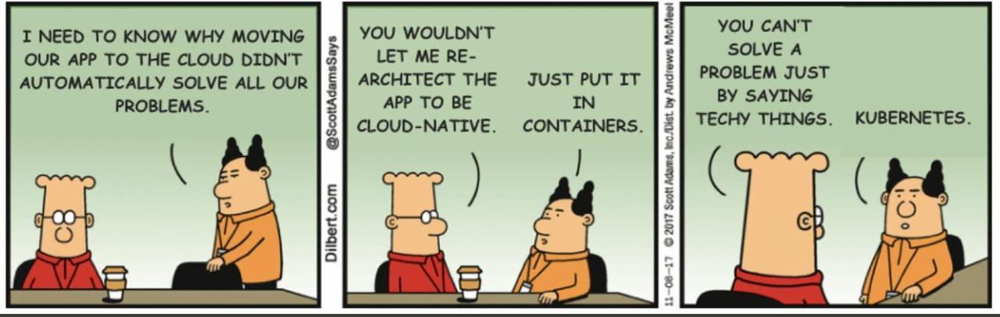

# Semana 1 - Apresentação e Introdução

## Logística
Sua primeira fonte de informação sobre esta disciplina é este sítio, que apontará para as notas de aula, atividades e outros documentos.

Usaremos a ferramenta Teams (tm) da Microsoft para nossos encontros síncronos, atendimento a alunos e para comunicação em geral.
Após criar sua conta **usando o email da UFU**, cadastre-se na disciplina [aqui](https://teams.microsoft.com/l/team/19%3aaa949b16dda54fc8b612566bb652f888%40thread.tacv2/conversations?groupId=a430897a-9525-41ab-a06d-72e1137b3cde&tenantId=cd5e6d23-cb99-4189-88ab-1a9021a0c451). O código para aceite automático deve ter sido enviado para o seu email cadastrado no sistema da UFU.

Este material é comum para as duas disciplinas, isto é, GBC 074 (BCC) e GSI 028 (BSI).
Por este motivo, as atividades síncronas de uma turma serão usadas como assíncronas na outra turma.
Para deixar bem claro, as atividades semanais serão desenvolvidas segundo o cronograma abaixo, lembrando que isto é um plano, e planos podem ser alterados, isto é:

* Semana 1  
    * 26/10, 8:50 - Atividade Síncrona (Aula 1 - GBC)
    * 26/10, 20:50 - Atividade Síncrona **excepcional** (Aula 1 GSI)
    * 28/10, 19:00 - Atividade Síncrona (Aula 2 GSI)
    * 29/10, 9:00 - Atividade Assíncrona (Aula 2 GBC)
    * 29/10, 9:00 - Atividade Assíncrona (GBC e BSI)
* Semana $X = [2,...,8]$
    * Segunda-feira, 8:50 - Atividade Síncrona (Aula $2X-1$ GBC)
    * Segunda-feira, 8:50 - Atividade Assíncrona (Aula $3X-1$ GSI)
    * Quarta-feira, 20:50 - Atividade Síncrona (Aula $2X$ GSI)
    * Quinta-feira, 9:00 - Atividade Assíncrona (Aula $2X$ GBC)
* Semana 9
    * Segunda-feira, 8:50 - Atividade Síncrona (Aula 18 GBC)
    * Segunda-feira, 20:50 - Atividade Síncrona **excepcional** (Aula 18 GSI)
    * Terça-feira, 23:59 - Limite do prazo para submissão dos seminários
    * Sexta-feira, 11:59 - Limite do prazo para submissão das atividades assíncronas

#### Controle de Frequência

O **controle de frequência**  nas atividades síncronas será feito pelo relatório de presença apresentado pelo Teams e por chamadas feitas pelo chat em momentos aleatórios da aula. Isto é, apenas estar logado não é garantia de que receberá presença.

Nas atividades assíncronas, o controle será feito pela submissão de respostas às atividades propostas, como questionários.

#### Programa

A disciplina abordará os tópicos definidos na ficha da disciplina, disponível no sítio do curso.

O plano da disciplina, aula-a-aula estará disponível na aba **Arquivos** no Teams.

#### Avaliação

Vocês serão avaliados de acordo com os critérios também disponíveis no plano.

#### Atividades Assíncronas

Todas as semanas serão propostas atividades assíncronas com textos, vídeos, exercícios, questionários e laboratórios.

* Todos os questionários são **obrigatórios**.  
* Todas as notas de aula são **obrigatórias**.
* Todas os materias marcados com um :warning: são de estudo **obrigatório**.
* O que não for obrigatório é fortemente recomendado.

Você deve cumprir as atividades propostas **até o fim do dia anterior ao da próxima atividade síncrona**. 

Na última semana, a atividade deve ser cumprida **até a sexta-feira** da mesma semana.

### Seminários

Os alunos deverão apresentar seminários, desenvolvidos em grupos de 8 alunos, para seus colegas.

O **objetivo** dos seminários é apresentar tópicos modernos relacionados à computação distribuída.

A duração dos seminários será definida após determinado o tamanho da turma, mas deverá ser em torno de 50 minutos **de apresentação**; respeito ao tempo, tanto para mais quanto para menos, é um **critério de avaliação**.

Sua apresentação será avaliada nos seguintes pontos:

* Conteúdo: 
    * Contextualização
    * Importância para o profissional da área
    * Referencial teórico
    * Algo mais: discussão, vídeo, lab
* Postar vídeo da apresentação até a terça feira da última semana de aula. 
* Qualidade dos slides
* Os seminários serão avaliados pelos pares e pelo professor.

Como sugestão inicial de temas, temos a seguinte lista, que pode ser expandida por sugestão dos alunos:

* Arquiteturas distribuídas reativas usando Kafka
   3. Arthur Filipe Sousa Gomes
   2. Guilherme Henrique de Araújo Santos
   1. Guilherme Moreira Bonfim de Freitas
   1. Luiz Henrique Dias Lima
   1. Silas Mota de Sousa
   1. Tiago Vieira Machado
* Framework SpringBoot para Microsserviços
* O protocolo PBFT
* Event sourcing
* [Algorand](https://algorand.foundation/)
* Containers docker no desenvolvimento de aplicações distribuídas
* [Dapr](https://docs.dapr.io)
* (mais serão adicionados)

### Projeto

* Grupos dos trabalhos serão compostos por 6 alunos.
   * Não, não pode ter mais de 6.
   * Pode ter menos, mas não recomendo, pois o trabalho dá trabalho.
   * Podem misturar BCC e BSI se facilitar.
   * Quem ficar sem grupo, forme um grupo. Podem usar este chat aqui para se encontrarem.
* [Especificação](https://lasarojc.github.io/ds_notes/projeto/)

## Aula 1: O quê? Por quê? Como? (2 horas)

* [Vídeo da Aula - BSI](https://web.microsoftstream.com/video/2901c5c2-0dc0-4b5d-beac-ab40a7e577b3)
* [Vídeo da Aula - BCC](https://web.microsoftstream.com/video/b90978df-c533-4a01-a830-43784d2b547a)

### Leituras
* [Prólogo](https://lasarojc.github.io/ds_notes/)
* [Introdução](https://lasarojc.github.io/ds_notes/intro/) (até Escalabilidade)

### Pontos Principais
* Não seja um sapo cozido!
* Computação distribuída é um tipo de mágica
* Grandes avanços recentes tem um pé na computação... distribuída
    * Metaverso
    * Mandalorian
    * Telemedicina
    * SpaceX

### Questionário
Postado no Teams

## Atividade Assíncrona 1: Tipos e arquiteturas (2 horas)
Nesta atividade assíncrona você aprenderá sobre os tipos e arquiteturas dos sistemas distribuídos, isto é, sobre os tipos de problemas resolvidos e como as peças dos sistemas são encaixadas para resolver estes problemmas.

### Leituras
* [Tipos de SD](https://lasarojc.github.io/ds_notes/intro/#tipos)
* [Arquiteturas](https://lasarojc.github.io/ds_notes/intro/#arquiteturas)
* :warning: [Muitos nós, um sistema distribuído](https://dev.to/vaidehijoshi/many-nodes-one-distributed-system-kl9)
* [Diferenças entre sistemas centralizados, decentralizados e distribuídos](https://www.8bitmen.com/difference-between-centralized-decentralized-distributed-systems-explained/)
* [Transparência - Parte 1](https://dev.to/vaidehijoshi/transparency-illusions-of-a-single-system-part-1-17ao)
* [Transparência - Parte 2](https://dev.to/vaidehijoshi/transparency-illusions-of-a-single-system-part-2-lbb)

### Pontos Principais
* Transparência total é desejável mas impossível
* Middleware são facilitadores do desenvolvimento
* Diversos tipos e arquiteturas
* Sistemas fortemente e fracamente acoplados.

### Questionário
Postado no Teams

## Aula 2: O substrato (2 horas)

[Vídeo da Aula](https://web.microsoftstream.com/video/9070f9c2-95dd-4d52-bd2a-fd9af3d5d2fd)

Nesta aula nós relembraremos os [fundamentos](https://lasarojc.github.io/ds_notes/basics/) de redes de computadores e do protocolo IP, o substrado no qual sistemas ditribuídos fracamente acoplados executam. 

### Leituras

* [Fundamentos](https://lasarojc.github.io/ds_notes/basics/), mas não a parte sobre multithreading.

## Atividade Assíncrona 2: Laboratório de Sockets (2 horas)

Submeta a resposta dos seguinte exercícios no questionário:

* Múltiplos Pacotes
* Ping-pong
* Ping-pong UDP
* IP-Multicast

### Leituras

* [No princípio, era o socket](https://lasarojc.github.io/ds_notes/basics/#no-principio-era-o-socket)
