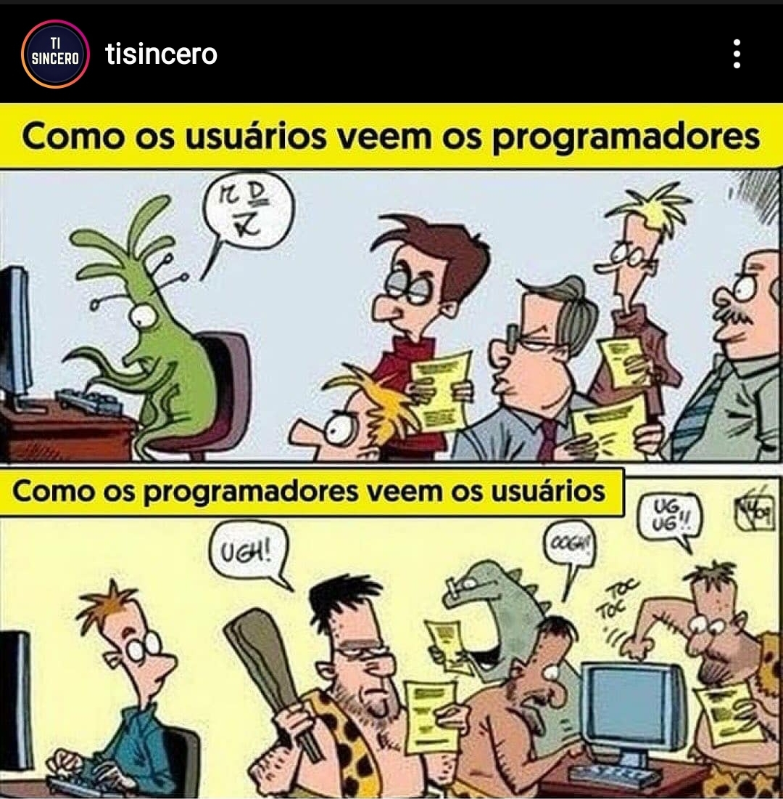
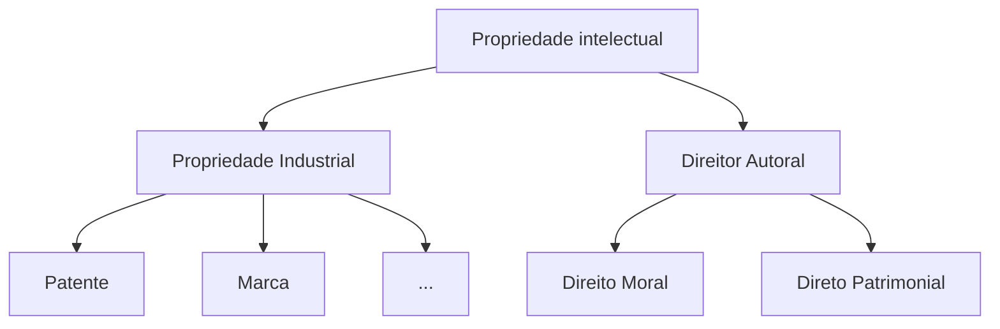

# Profissão em Sistemas de Informação 
O objetivo desta disciplina é preparar os discentes para atuarem com consciência, ética e responsabilidade na sociedade em geral e em seus ambientes de trabalho, de forma empática e respeitosa ao próximo, independentemente de qualquer fator, e de forma a minimizar impactos negativos e maximizar os positivos da tecnologia da informação na sociedade e no ambiente.

Se está interessado na disciplina, na forma de AARE, matricule-se e continue lendo. 
Caso contrário, volte no próximo semestre quando, possivelmente, teremos atividades presenciais. 
Lembre-se, GSI009 é uma disciplina obrigatória do currículo.

Se está lendo isto, então assumo que se matriculou; ótimo!
Sua primeira fonte de informação sobre esta disciplina é este sítio, que conterá notas de aula, atividades e apontadores para outros documentos e instruções de acesso. 

Além disso, usaremos a ferramenta Teams (tm) da Microsoft para nossos encontros síncronos, atendimento a alunos e para comunicação em geral.
Após criar sua conta **usando o email da UFU**, cadastre-se na disciplina [aqui](https://teams.microsoft.com/l/channel/19%3a56c44b01d2a34cfdbfb379e16d7514a8%40thread.tacv2/General?groupId=c380e925-e50b-47b0-8464-063f6e5cea13&tenantId=cd5e6d23-cb99-4189-88ab-1a9021a0c451).

O **controle de frequência**  nas atividades síncronas será feito pelo relatório de presença apresentado pelo Teams, que diz exatamente quando entrou e quando saiu da reunião.
Nas atividades assíncronas, o controle será feito pela submissão de respostas às atividades propostas, como questionários.

##Semana 1 - 12/08/2020

### Programa

A disciplina abordará os tópicos definidos na ficha da disciplia, disponível no sítio do curso.
O plano da disciplina, aula-a-aula está disponível [aqui](./docs/gsi009.pdf) e na aba **Arquivos** no Teams.

### Avaliação

Vocês serão avaliados de acordo com os critérios também disponíveis no plano.
Para cada atividade do tipo $X$, a nota $N(X)$ da atividade será calculada pela fórmula

$N(X) = \frac{N(X_1) + N(X_2) + ... + N(X_m)}{m}$

onde $N(X_i)$ é a $i$-ésima atividade do tipo $X$, de um total de $m$.

### Atividades Assíncronas

**Assista e leia** a pelo menos os item marcados com o ícone :warning: e então responda aos questionários da semana no Teams.
Você deve cumprir as atividade **até o fim do dia anterior ao da próxima atividade síncrona**. Na última semana, a atividade deve ser cumprida **até a sexta-feira** da mesma semana.

### Seminários

Os alunos deverão apresentar seminários, desenvolvidos em grupo, para seus colegas.
O **objetivo** dos semináris é estimular discussão sobre o tópico em tela.
Para isso, planeje seu seminário para que tenha **duração de 75 minutos**, incluindo discussão; este é um **critério de avaliação**.

Os seminários tem tópicos **Técnicos**  e **Não técnicos**; por serem mais difíceis de se preparar, os não técnicos acontecerão por último.
A escolha do tópico será, em princípio, livre, desde que cada tópico tenha **um quinto** dos alunos da turma. Caso isso não aconteça, a os grupos serão impostos.

Sua apresentação será avaliada nos seguintes pontos:

* Conteúdo: 
    * Contextualização
    * Importância para o profissional da área
    * Legislação pertinente
    * Referencial teórico
    * Algo mais: discussão, vídeo, dinâmica, pessoas importantes...
* Postar os slides 2 dias antes da apresentação via Teams
* Qualidade dos slides

Além da apresentação, você deverá preparar um questionário com questões pertinentes ao tema e que sejam abordados durante a apresentação.
Estes serão avaliados pelos critérios a seguir:

* Qualidade do quiz
    * Perguntas pertinentes a quem se interessar pela área
    * Perguntas em português correto
* Entregar Quiz 2 dias antes da apresentação
    * Enviar formulário no Teams, **somente para o professor**
    * Enviar gabarito em mensagem separada, **somente para o professor.**
    * Questionário deve ter 5 perguntas de múltiplas alternativas
    * Cada pergunta deve ter 5 respostas

#### Tema 1: Computação Verde

Todos ouvimos já ouvimos falar das [alterações climáticas](https://www.eea.europa.eu/themes/climate/faq/everything-on-climate-change-in-226-words) sendo causadas pela humanidade e independentemente de você aceitar o consenso (maioria de opiniões) dos especialistas sobre o fato ou ser um negacionista, o fato é que a economia mundial aceita a ideia e tem tentado criar mecanismos para diminuir o nosso efeito no globo.

Todos nós já ouvimos falar também sobre como a culpa é dos viajantes, dos ruminantes, e dos refrigerantes. Mas saiba que a computação tem uma grande parcela da culpa. Algumas estimativas colocam em [14% as emissões devidas aos Data Centers](https://www.theguardian.com/environment/2017/dec/11/tsunami-of-data-could-consume-fifth-global-electricity-by-2025) até 2040.
Por isso, o tópico da **computação ou TI verde** está em voga.

Sua missão, caso você decida aceitá-la, é expandir na contextualização acima, discutir a computação verde em seus aspectos econômicos, legais e morais, com foco na atuação sua e de seus colegas na sociedade e no mercado de trabalho.

Certifique-se de discutir, sem se limitar a, os seguintes pontos:

* Consumo energético de datacenters
* Energia renovável
* Certificações
* Carbon footprint
* Estratégias para implementação
* Cidades inteligentes
* Legislação
* Lixo eletrônico

#### Tema 2: Propriedade intelectual

Para começar, pense nas seguintes questões:

!!!question 
    * Se você compra um carro, pode modificá-lo? Rebaixá-lo? Mudar a cor?
    * Se compra uma casa, pode modificá-la? Pode adicionar um quarto? Uma piscina?
    * Se compra um computador, pode modificá-lo? Colocar mais memória? Mudar o sistema operacional? 

Todas estas questões estão ligadas ao tema da Propriedade Intelectual, um tema muito controverso.
Se você compra, é o dono, certo? Se é o dono, deveria poder modificar, certo? Mas muitos dos produtos que compra não podem ser modificados, abertos, estudados, replicados.
Como comprador, talvez você se sinta indignado.

É fácil entender que não se pode copiar uma Ferrari, pois anos e anos foram dedicados ao seu desenvolvimento e não seria justo alguém que não a [Ferrari lucrar com isso](https://jornaldocarro.estadao.com.br/carros/ferrari-processa-brasileiro-por-copia/).
Mas ao mesmo tempo, copiar e assistir a um filme, é algo inócuo, certo? Ninguém sofre perdas se você assistir a uma série pirata, pois se você não o fizesse, a empresa que produziu o filme não ganharia nada de qualquer forma, certo? Errado. [Mesmo que insignificante, piratear filmes é crime](https://canalcienciascriminais.com.br/pirataria-virtual-download/).

Mas vamos trazer o problema para mais próximo de casa. E se falarmos de software?
Dificilmente algum "computeiro" poderia se gabar de nunca ter instalado um software pirata, um sistema operacional.
Também é uma ação sem vítimas, certo?

Mas como produtor de software, algo que é muito facilmente replicado, talvez você sinta que qualquer um que use seu produto deveria pagar por ele. 
Ou talvez você sinta que todo software deva ser modificável, estudável e copiável?

Neste seminário, seu objetivo é discutir estas questões, inclusive mas não limitado aos seguintes pontos:

* Software Livre x Open Source
    * O quê são?
    * Qual a filosofia por trás?
    * Como ganhar dinheiro?
    * Quem é Richard Stallman?

* Propriedade intelectual
    * Propriedade industrial
    * Direitor autorais no Brasil
    * Copyright e copyleft 
    * Patentes
        * boas ou más?
    * Registro de software
    * Certificado de anterioridade

Como faísca para seu trabalho, considere os seguintes materiais.

* 
* 
* [Richard Sennett: “O gratuito significa sempre uma forma de dominação”](https://brasil.elpais.com/brasil/2018/08/09/cultura/1533824675_957329.html)

 
#### Tema 3: Privacidade e hacking

Ninguém sai às ruas grudando nas paredes e posts as fotos de suas viagens, festas em que foi, ou refeições que fez.
Contudo, muitos não se incomodam em fazê-lo na Internet, local com até mais visibilidade que os postes da sua cidade.
Ao escancarar os detalhes da sua vida na Internet, você está abrindo mão da sua "privacidade digital".

!!!quote "[Privacidade Digital](https://pt.wikipedia.org/wiki/Privacidade_digital)"
     A privacidade digital é a habilidade de uma pessoa em controlar a exposição e a disponibilidade de informações seja dela, de um conhecido ou até mesmo de um desconhecido, na internet, através dos sites de compartilhamento e redes sociais. A atual arquitetura da internet permite o desenvolvimento de novas tecnologias de controle de informações, alterando a forma de como cada pessoa vê a privacidade.

Por mais que ache normal abrir mão do controle dos seus dados, do ponto de vista de desenvolvedor de sistemas de informação, é importante saber que a legislação brasileira protege o direito à privacidade digital de todos os cidadãos.
A [Lei Geral da Proteção dos Dados](http://www.planalto.gov.br/ccivil_03/_ato2015-2018/2018/Lei/L13709.htm) dita que nenhuma empresa deveria manter mais informações sobre seus usuários do que é necessário para prover o serviço em questão, e que os dados mantidos devem ser protegidos por mecanismos de segurança que garantam sua inviolabilidade. E esteja certo, há sempre aqueles que tentarão obter estes dados para usar das mais diferentes formas, por meio de hacking, engenharia social, e roubo de dados, e não somente dados relativos a pessoas, mas também dados de processos industriais, movimentações bancárias e por aí vai.

Neste seminário, você deverá abordar as questões privacidade digital, entrar em detalhes sobre o que exige a lei e quais as punições caso seja violada.
Você também deverá discutir conceitos e técnicas relacionadas à violação de dados.
Em suma, você deverá discutir, sem se limitar a, os seguintes tópicos:

* Hacking
    * Definição?
    * Bom ou mau?
    * Variantes?
    * Técnicas
    * Black/White/Gray hat
    * Hacking ético
    * Exemplos?
    * O que diz a legislação brasileira
* O que é privacidade de dados
    * O que são dados pessoais?
    * Como garantí-la
    * O que diz a legislação brasileira.
    * O direito ao esquecimento

Como material inicial, veja

* [The 'Internet of Things' Is Sending Us Back to the Middle Ages](https://www.realclearscience.com/articles/2017/09/06/the_internet_of_things_is_sending_us_back_to_the_middle_ages_110384.html)
* [Lei Geral da Proteção dos Dados](http://www.planalto.gov.br/ccivil_03/_ato2015-2018/2018/Lei/L13709.htm) 
* [Mesa Redonda Sobre LGPD](https://www.youtube.com/watch?v=3JTJCb6Whxc)
* [Webminário: Tudo sobre a LGPD](https://www.youtube.com/watch?v=B4BeLfsp5_s) 

#### Tema 4: Assédio

Quando no meio profissional, você certamente e infelizmente terá "oportunidades" de presenciar ou vivenciar assédio, ou seja, comportamento indevido, geralmente repetitivo, que visa diminuir, ofender, obter vantagens da pessoa assediada.
Vocês precisam então saber como identificar, se defender, defender seus pares, e porquê não praticar assédio.

Neste seminário, você deverá então abordar os seguintes tópicos, sem se limitar a:

* Assédio
   * Assédio sexual
   * Assédio moral
   * Efeitos nos assediados
   * Alvos
* Legislação 
* Ciberbullying.

Para facilitar seu trabalho, sugiro os seguintes materias abaixo como ponto de partida.

* [Cartilha](./docs/CARTILHAASSEDIOMORALESEXUAL.pdf)
* [Cartilha](./docs/CARTILHAASSEDIOMORALESEXUAL2.pdf)
* [Cartilha](./docs/CARTILHAASSEDIOMORALESEXUAL3.pdf)
* [That's harassment](https://www.youtube.com/watch?v=MV7a-oetsB0)
* [Assédio sexual no Vale do Silício](http://money.cnn.com/technology/sexual-harassment-tech/)

#### Tema 5: Relações raciais e de gênero no trabalho.

O Brasil é um país marcado pela desigualdade, em vários aspectos da sociedade, e esta desigualdade reflete e alimenta a discriminação das pessoas.

* Há a discriminação por profissão, que coloca profissionais de uma área como meros cidadãos, abaixo dos que são "engenheiro civil formado" e outros "dotôs". 
* Há a discriminação pela diferença de gênero. 
* Há a [discriminação por cor da pele](https://nacoesunidas.org/acao/discriminacao-racial/). Há a discriminação por origem geográfica(https://noticias.uol.com.br/cotidiano/ultimas-noticias/2016/02/24/negros-e-nordestinos-sao-principais-vitimas-de-discriminacao-em-sp.htm)
* Há também por orientação sexual.
* Opção religiosa

Enfim, o Brasil é rico nestes problemas, e todos eles refletem no mercado de trabalho.
Neste seminário, você deverá abordar esta temática, tocando nos seguintes tópicos, sem se limitar aos mesmos:

* Conceito de raça e Raça entre humanos
* Cis, trans, homo, hetero, gênero?
* Diferenças intelectuais entre “raças” e gêneros
* Mulheres importantes na computação
* O que diz a legislação brasileira?

Para iniciar seu trabalho, sugiro os links acima e a seguinte lista.

* [Sexismo no vale do silício](http://video.wired.com/watch/women-engineers-on-the-rampant-sexism-of-silicon-valley)
* [Quotas no ensino superior](https://larrlasa.org/articles/10.25222/larr.50/)
* [Segregação ocupacional e hiato salarial entre os gêneros](https://www.insper.edu.br/wp-content/uploads/2015/12/segregacao-ocupacional-hiato-salarial-entre-os-generos.pdf)

### Atividade Assíncrona: Computação e Sociedade

Os vários ramos da computação, estando presentes cada vez mais na vida das pessoas, certamente podem afetar positiva e negativamente estas vidas.
Assim, é importante pensar sobre como nossas atuações como "computeiros" impactam a sociedade ao nosso redor, a despeito da sociedade entender o que fazemos ou não

Para dar alguns exemplos simples e bem próximos, pensemos na quantidade de dados pessoais que as redes sociais acumulam.
Você, ao criar sua conta do Facebook ou Instagram, leu os termos de serviço? Sabe quais dados podem ser gravados e com quem podem ser compartilhados? A frase seguinte descreve bem a situação:

> [Se você não está pagando pelo produto, então o produto é você!](https://www.quora.com/Who-originally-suggested-that-if-youre-not-paying-for-the-product-you-are-the-product)

Em praticamente todos os serviços de redes sociais, todas as sua interações são gravadas e usadas para montar seu perfil, que será colocado em grupos usados para direcionar anúncios e campanhas. Por mais que você possa se achar especial, saiba que somos muito, muito previsíveis e que podemos ser facilmente manipulados. Para ver um grande exemplo disso, pense nas campanhas políticas de 2016 nos estados unidos e 2018 no Brasil. Milhares de mensagens direcionadas os eleitores indecisos serviram para virar a balança para um lado ou para outro, como é muito bem documentado em "Big Hack", disponível no Netflix.

Mas para além dos perfis das redes sociais, a tecnologia poderá afetar nossa vida de outras formas também muito importantes.
Ela permite a geração e processamento de imagens médicas de forma a melhorar diagnósticos, permite cirurgias a longa distância, o entretenimento no conforto da sua casa, o relacionamento com outrem, o aumento da eficiência dos negócios, a otimização de transportes, *etcetera*.

Infelizmente, parece que toda tecnologia com potencial para uso benéfico à sociedade, também pode ser usada em seu detrimento.
Por exemplo, as IA (Inteligências Artificiais) sendo treinadas por dados classificados por humanos, perseverarão divisões sociais, desigualdades e discriminações.
Steven Levy discute esta ideia muito bem no artigo [*We Asked for Flying Cars. We Got Axl Rose's Twitter Spat*](https://www.wired.com/story/plaintext-we-asked-for-flying-cars-we-got-axl-roses-twitter-spat/).

Na ficção, vemos vários exemplos destas reviravoltas. Em específico, o episódio
[Black Mirror (Season 3): Nosedive](https://www.netflix.com/title/80117542?s=a&trkid=13747225&t=more)
fala muito bem sobre como a tecnologia, neste caso em específico as redes sociais que são muito presentes em nossas vidas, tem o potencial de alterar a forma como nos comunicamos, compartilhamos informação, e somos classificadados em nossa sociedade.
Outro exemplo, o filme [Minority Report](https://www.netflix.com/title/60023071) fala sobre como uma tecnologia para a prevenção de crimes pode ser usada para cercear a liberdade das pessoas.

Apesar do futurismo do vídeos, situações exatamente como estas já estão acontecendo, como se pode ver em

* [Facial recognition, data harvesting and the end of privacy](https://www.verdict.co.uk/facial-recognition-data-harvesting/):warning:
* [Facing Up to Facial Recognition](https://spectrum.ieee.org/computing/software/facing-up-to-facial-recognition):warning:
* <iframe width="560" height="315" src="https://www.youtube.com/embed/7lpCWxlRFAw" frameborder="0" allow="accelerometer; autoplay; encrypted-media; gyroscope; picture-in-picture" allowfullscreen></iframe> :warning:
* [Police Unlock AI's Potential to Monitor, Surveil and Solve Crimes](https://www.youtube.com/watch?v=H_fyQCeBaeM&feature=emb_rel_end)

Embora o reconhecimento facial receba grande parte da atenção , há vários outros exemplos de tecnologia sendo usada em detrimento da sociedade, não por erro do julgamento, mas por direta ação de engenheiros, administradores e **desenvolvedores de software**, é o caso da Volkswagen, documentado no Episódio 1, Temporada 1, de [Dirty Money](https://www.netflix.com/title/80118100), no Netflix. 
Fontes sobre o mesmo assunto abundam, por exemplo 

* [Volkswagen emissions scandal](https://www.wired.com/2015/09/vw-fool-epa-couldnt-trick-chemistry/):warning:

Felizmente, há também reações dos seus colegas de profissão, como visto na iniciativa [Ethical OS](https://ethicalos.org/), que discutiremos nas próximas semanas.

## Semana 2 - 19/08/2020

Antes de falarmos sobre os pontos e materiais vistos na atividade assíncrona da semana 1, vamos definir um arcabouço teórico para falarmos sobre o certo e o errado na exercício da profissão.

### Ética x Moral

A palavra **ética** vem do grego *éthos*, que  significa "costume", segundo o [Priberam](https://dicionario.priberam.org/ética), mas a conotação que nos interessa aqui é mais restrita.

!!!quote "Ética"
    Conjunto de regras de conduta de um indivíduo ou de um grupo.

    ["ética", in Dicionário Priberam da Língua Portuguesa, 2008-2020](https://dicionario.priberam.org/%C3%A9tica [consultado em 11-08-2020].") 

Este conjunto de regras evolue com os tempos, refletindo a sociedade que as gera. Entretanto, a ética segue princípios universais que deveriam ser atemporais. Reforçando, **deveriam** ser atemporais, mas são reflexo da sociedade que as gera, que escolhe como agir. Segundo [Cortella](http://www.mscortella.com.br/artigo-cortella-etica-moral-valores-principios-6a), 

> a ética é o conjunto de princípios e valores que usamos para decidir a nossa conduta social.

O comportamento gerado no contexto da ética é chamado *moral*, isto é, a materialização da ética em práticas, e que refletem muito a cultura em que se desenvolve. A moral é mais volátil.

Poderíamos dizer que a moral "aspira" ser a ética, mas que esta aspiração está longe de ser alcançada, se não for intangível.
Por exemplo, podemos pensar facilmente em ações que, consideradas morais muito recentemente, hoje são consideradas aberrações, pelo menos em algumas sociedades.

* [Castração feminina](https://pt.wikipedia.org/wiki/Mutila%C3%A7%C3%A3o_genital_feminina)
* Pena de morte para adúlteros
  > Deuteronômio 22:22 - Se um homem for pego em flagrante deitado com a mulher de outro, os dois deverão pagar por esse delito com pena de morte, o homem e a mulher com quem se deitou. Desse modo extirparás o mal do meio do teu povo, ó Israel.
* Escravagismo
  > Êxodo 21:1-6 - Estes são os estatutos que lhes proporás: Se comprares um servo hebreu, seis anos servirá; mas ao sétimo sairá forro, de graça. Se entrar sozinho, sozinho sairá; se tiver mulher, então com ele sairá sua mulher. Se seu senhor lhe houver dado uma mulher e ela lhe houver dado filhos ou filhas, a mulher e os filhos dela serão de seu senhor e ele sairá sozinho. Mas se esse servo expressamente disser: “Eu amo a meu senhor, a minha mulher e a meus filhos, não quero sair forro”, então seu senhor o levará perante os juizes, e o fará chegar porta, ou ao umbral da porta, e o seu senhor lhe furará a orelha com uma sovela; e ele o servirá para sempre.
* Casamento com menores de idade - Converse com seus pais e avós sobre o assunto. É muito possível que uma de suas ancestrais recentes tenha "se casado" com 13 ou 14 anos de idade.

Assim, embora a Moral varie e Ética não, como sociedade, o que consideramos ético nada mais é que moral, e certamente irá mudar no futuro.
Por exemplo, quem garante que no futuro não será considerado (por todos) que comer carne é uma abominação?
Logo, doravante, quando falarmos de ética, lembre-se que estamos falando na verdade do que achamos ser ético hoje, isto é, moral.

Se você ficou mais confuso que esclarecido, teremos um oportunidade de em um futuro próximo esclarecer estas dúvidas com um especilista na área. Por enquanto, para melhor entender o que é ético, pode ser útil ver alguns exemplos do que obviamente não é, em várias situações.

!!!example "Exemplos de falta de ética na vida" 
    * Achar uma carteira com dinheiro, pegar o dinheiro e jogar a carteira fora, sem ter feito um esforço sincero para encontrar o dono.
    * Comer o lanche do seu colega de república, sem autorização.
    * Violar acordo de monogamia.

Algo interessante sobre o último ponto acima é que embora para maior o acordo seja entre duas partes, muitos considerarão que o acordo é com a sociedade. Este seria também um exemplo interessante para falar sobre hipocrisia, mas deixaremos isso para outro momento.

Já outros exemplos são mais complicados. 
Se eu te perguntar se é anti-ético cobrar 5000 reais por uma página Web feita no Word, você provavelmente diria que não, afinal, desde que você esteja entregando o produto e seu cliente esteja disposto a pagar, então tudo bem, certo? Mas e se seu cliente não tiver opção ou se não tiver informação o suficiente para detectar que está sendo explorado, ainda assim é ético cobrar tal valor? Vejamos um caso real com uma ideia parecida:

!!!note "Pharma Bro"
    In September 2015, Shkreli received widespread criticism when Turing obtained the manufacturing license for the antiparasitic drug Daraprim and raised its price by a factor of 56 (from US$13.5 to $750 per pill), leading him to be referred to by the media as "the most hated man in America" and "Pharma Bro" ([Fonte](https://en.wikipedia.org/wiki/Martin_Shkreli))

Este exemplo, onde um remédio teve seu preço aumentado de 13 para 750 Dólares, por pílula, décadas depois de ter sido inventado, e com processo de fabricação simples, [reprodutível por adolescentes](https://blogs.sciencemag.org/pipeline/archives/2016/12/01/those-australian-students-and-their-daraprim), é excelente para indicar uma idiossincrazia da sociedade capitalista.
Enquanto difícilmente alguém considerará o aumento ético, a relativização do que é errado e certo é muito comum em nossa sociedade. 

Vejamos alguns exemplos na universidade, mais próximos de nós, e muito bem apontados neste [blog](https://rbribeiro.wordpress.com/2015/06/24/como-e-dar-aula-no-ensino-superior-e-a-corrupcao-na-universidade/).

!!!example "Exemplos de falta de ética na Universidade"
    * "Copia lista de exercício para conseguir se formar sem esforço e critica vagabundo por não arrumar uma enxada e ir capinar um terreno."
    * "Pede para o colega assinar a lista de presença e depois critica funcionário fantasma."
    * "Cola nas provas e grita "abaixo a corrupção!" na próxima manifestação."

Embora os exemplos aqui sejam de ações não éticas dos alunos, é óbvio que há problemas do lado da universidade também, em vários níveis.

!!!example "Exemplos de falta de ética na Universidade"
    * [Professores da UFRGS são presos por fraude em bolsas de estudo](http://g1.globo.com/rs/rio-grande-do-sul/noticia/2016/12/professores-da-ufrgs-sao-presos-por-fraude-em-bolsas-de-estudo.html).
    * [Envolvidos em fraude no vestibular da UFU devem ressarcir cofres públicos](http://g1.globo.com/minas-gerais/triangulo-mineiro/noticia/2017/02/envolvidos-em-fraude-no-vestibular-da-ufu-devem-ressarcir-cofres-publicos.html)
    * [MPF/MG: professor universitário com dedicação exclusiva não pode exercer outra atividade remunerada](https://mpf.jusbrasil.com.br/noticias/100129219/mpf-mg-professor-universitario-com-dedicacao-exclusiva-nao-pode-exercer-outra-atividade-remunerada)
    * Professor falta e não repõe com outra atividade ou aula

Este último exemplo não dá manchete no jornal porquê os alunos preferem não ter a aula reposta, não é mesmo? Mas sabemos que é errado.

### Ética no Exercício da Profissão

O comportamento antiético se estende aos postos de trabalho, obviamente, onde funcionários não cumprem horários, chefes assumem os méritos dos trabalho de seus subalternos, sabotagens abundam e discriminação é algo constante.
Para minimizar atos antiéticos como estes, diversas profissões produzem **códigos de ética**, manuais gerais de conduta no exercício da profissão.

Um dos exemplos mais famosos é o código da medicina, publicizado na mídia. 
O famoso **Juramento de Hipócrates** parece ser um e universal, mas como poderia? 
Obviamente o mesmo sofreu alterações com a passagem do tempo e espalhamento pelo mundo.
Veja a seguinte versão, que contem partes que obviamente deixaram de ser válidas e outras que nem precisariam ser ditas.

!!!quote "Juramento de Hipócrates"
    Eu juro, **por Apolo, médico, por Esculápio, Higeia e Panaceia, e tomo por testemunhas todos os deuses e todas as deusas**, cumprir, segundo meu poder e minha razão, a promessa que se segue:

    Estimar, tanto quanto a meus pais, aquele que me ensinou esta arte; **fazer vida comum e, se necessário for, com ele partilhar meus bens**;    

    Ter seus filhos por meus próprios irmãos; ensinar-lhes esta arte, se eles tiverem necessidade de aprendê-la, sem remuneração e nem compromisso escrito; fazer participar dos preceitos, das lições e de todo o resto do ensino, meus filhos, os de meu mestre e os discípulos inscritos segundo os regulamentos da profissão, porém, só a estes.    

    Aplicarei os regimes para o **bem do doente segundo o meu poder e entendimento, nunca para causar dano ou mal a alguém**. A ninguém darei por comprazer, nem remédio mortal nem um conselho que induza a perda. Do mesmo modo **não darei a nenhuma mulher uma substância abortiva**.
    Conservarei imaculada minha vida e minha arte.

    Não praticarei a talha, mesmo sobre um calculoso confirmado; deixarei essa operação aos práticos que disso cuidam.

    Em toda a casa, aí entrarei para o bem dos doentes, mantendo-me longe de todo o dano voluntário e de toda a **sedução sobretudo longe dos prazeres do amor, com as mulheres ou com os homens livres ou escravizados**.

    Àquilo que no exercício ou fora do exercício da profissão e no convívio da sociedade, eu tiver visto ou ouvido, que não seja preciso divulgar, eu conservarei inteiramente secreto.

    Se eu cumprir este juramento com fidelidade, que me seja dado gozar felizmente da vida e da minha profissão, honrado para sempre entre os homens; se eu dele me afastar ou infringir, o contrário aconteça.

    ???todo  "levantar fonte."

Este juramento tem seus méritos mas é ridículo em alguns pontos, como bem apontado por [Dráuzio Varella](https://drauziovarella.uol.com.br/drauzio/artigos/o-juramento-de-hipocrates-artigo/). A versão seguinte, mais recente, faz mais sentido.

!!!quote "Juramento de Hipócrates"
    Prometo que, ao exercer a arte de curar, mostrar-me-ei sempre fiel aos preceitos da honestidade, da caridade e da ciência.

    Penetrando no interior dos lares, meus olhos serão cegos, minha língua calará os segredos que me forem revelados, o que terei como preceito de honra.

    Nunca me servirei da minha profissão para corromper os costumes ou favorecer o crime.

    Se eu cumprir este juramento com fidelidade, goze eu para sempre a minha vida e a minha arte com boa reputação entre os homens; se o infringir ou dele afastar-me, suceda-me o contrário.

    ???todo  "levantar fonte."

Ainda assim é estranho fazer um juramento para fazer seu trabalho corretamente. Imagine-se jurando que minimizará bugs no seu código e não acessará dados indevidamente.
Não, o juramento de Hipócrates é mais para ~inglês~ os pais verem que para servir como código de ética.
O verdadeiro [código de ética da Medicina no Brasil](https://portal.cfm.org.br/images/PDF/cem2019.pdf) é estabelecido pelo conselho federal de medicina e é bem mais extenso.

### Ética na Computação
Já na computação, como fica a questão da ética profissional?

Não há, no Brazil, um código de ética estabelecido pelo Conselho Federal dos Computeiros, até por quê não há um reconhecimento dos "computeiros" como uma classe profissional como é o caso dos médicos. 
Na computação, entra quem quiser, e fica quem se mostrar habilitado, tenha se formado em ciência da computação, engenharia elétrica, sistemas de informação, administração de empresas ou educação física, apesar de ser uma discussão [antiga](http://sbc.org.br/2-uncategorised/1272-regulamentacao-da-profissao).

Se não há definição de quem pode atuar com computação, há definitivamente muitos exemplos de falta de ética na área.
Como visto na atividade assíncrona, um sistema em parte software foi usado para enganar testes de emissão de poluentes por carros.  

Em um exemplo de "ladrão que rouba ladrão", o sítio Pirate Bay usava o computador de seus usuários para minerar cripto moedas.

e o robô de limpeza Roomba estava coletando informações sobre os interiores das casas, como quantidade de pessoas, marcas de produtos usados, mapa 3d do ambiente, e o fabricante poderia vender estas informações para outras empresas.

Em outro exemplo bem mais simples e comum, um desenvolvedor introduziu defeitos em seu software para ser convocado, e remunerado, para fazer correções.

Quer dizer que não há um código de ética a ser seguido na área?

Não é exatamente o caso, pois a [Sociedade Brasileira de Computação](http://sbc.org.br/), através de sua comissão de ética, propôs o seguinte [código de ética profissional](https://compesociety.blogspot.com/2016/09/sbc-e-o-codigo-de-etica-profissional.html). 

!!!quote "Código de Ética do profissional de Informática - SBC"
    * Art. 1°: Contribuir para o bem-estar social, promovendo, sempre que possível, a inclusão de todos setores da sociedade.
    * Art. 2°: Exercer o trabalho profissional com responsabilidade, dedicação, honestidade e justiça, buscando sempre a melhor solução.
    * Art. 3º: Esforçar-se para adquirir continuamente competência técnica e profissional, mantendo-se sempre atualizado com os  avanços da profissão.
    * Art. 4º: Atuar dentro dos limites de sua competência profissional e orientar-se por elevado espírito público.
    * Art. 5º: Guardar sigilo profissional das informações a que tiver acesso em decorrência das atividades exercidas.
    * Art. 6º: Conduzir as atividades profissionais sem discriminação, seja de raça, sexo, religião, nacionalidade, cor da pele, idade, estado civil ou qualquer outra condição humana.
    * Art. 7º: Respeitar a legislação vigente, o interesse social e os direitos de terceiros.
    * Art. 8º : Honrar compromissos, contratos, termos de responsabilidade, direitos de propriedade, copyrights e patentes.
    * Art. 9º : Pautar sua relação com os colegas de profissão nos princípios de consideração, respeito, apreço, solidariedade e da harmonia da classe.
    * Art. 10º: Não praticar atos que possam comprometer a honra, a dignidade, privacidade de qualquer pessoa.
    * Art. 11º: Nunca apropriar-se de trabalho intelectual, iniciativas ou soluções encontradas por outras pessoas.
    * Art. 12º: Zelar pelo cumprimento deste código.
    * Art. 13º: Reconhecer que qualquer violação das normas deste código é incompatível com sua associação à SBC.

Vejamos como isso afeta a sua vida, considerando algumas situações exemplo.

!!!question "Aplicando o código de ética da SBC"
    * Seu chefe lhe diz para modificar o preço de um item em um pedido enviado por um cliente.
    * Seu colega sugere que vocês abram o banco de dados de mensagens SMS trocados pelo sistema de telefonia da empresa em que trabalha.
    * Alguém lhe oferece 50 reais para baixar a imagem do dvd do Windows 10 da Internet e instalar em seu (da pessoa) computador.
    * Para garantir sua renda, introduz erros nos seus programas de forma que o empregador dependa de sua ["expertise"](https://thehackernews.com/2019/07/siemens-logic-bomb.html)

    Quais artigos do código de ética da SBC estes pedidos violam?

Mesmo que você não vá tatuar o código de ética proposto pela SBC nas costas ou recitá-lo três vezes antes de dormir, faz sentido seguir suas orientações gerais, que são, agir corretamente para com a **sociedade**, a **comunidade** (seus colegas de profissão), e com seu **empregador**.
Afinal, computação certamente já causará problemas demais em nossas vidas, no processo de torná-las melhor (veja dois exemplos a seguir). Então, não é necessário que nós, os "computeiros", ajamos de má fé.

### Revisão da Atividade Assíncrona da Semana 1

* O que vocês acharam dos vídeos que falam sobre pré-crime, ou o uso de IA para identificar crimes antes de acontecerem?
* Como fica a questão da privacidade?
* O pré-julgamento pode afetar o resultado, levando a profecias auto-realizadoras?
* Como previnir que tecnologias sejam mal utilizadas?

### Atividade Assíncrona: Computação e Sociedade

Quanto mais a IA se desenvolve, maior é seu potencial para nos auxiliar na tomada de decisões em nossas vidas.

* Qual a melhor vacina para COVID-19? 
* É melhor o carro se desligar neste semáforo e religar quando abrir ou manter o motor funcionando?
* Qual a melhor rota de entrega de encomendas?

Dentre as respostas para estas perguntas, é possível identificar aquela que é melhor. Para a segunda, por exemplo, se a IA mandar desligar o motor para apenas um segundo depois eu ter que religar o carro, então a resposta não foi boa e deve ser penalizada.  
Algumas perguntas, entretanto, são mais subjetivas.

* O comportamento desta pessoa, no parque, a meia-noite, é suspeito?
* Qual o melhor candidato para esta vaga de emprego? 
* Qual o melhor artigo para oferecer para leitura a este usuário?

E nesta subjetividade, os viéses dos humanos são reproduzidos nas máquinas.
No seu *feed* do Facebook por exemplo, você deve receber muito mais notícias sobre as vigens de seus colegas que de recalls de BMW. Isso acontece porquê o Facebook lhe oferece artigos que casam com seus interesses, levantados por anos de interação com o sistema.
Acontece que esta abordagem reforça seus interesses e lhe mantem é uma bolha.
Há vários casos documentados de viés no mundo da IA. 

 :warning: 

O problema principal aqui é que nossos viéses são reproduzidos sem nos darmos conta, e estes viéses poderiam ser a razão da nossa destruição. Se você nunca se preocupou com destruir formigas, seres inferiores a você, por quê uma IA deveria se importar com você, se lhe julgar inferior?

 :warning:

E alguns certamente acham que seremos inferiores em algum momento.

<iframe src="https://embed.ted.com/talks/nick_bostrom_what_happens_when_our_computers_get_smarter_than_we_are" width="854" height="480" style="position:absolute;left:0;top:0;width:100%;height:100%" frameborder="0" scrolling="no" allowfullscreen></iframe>

 :warning:

Eles certamente já jogam Mário melhor que eu.

<iframe width="560" height="315" src="https://www.youtube.com/embed/qv6UVOQ0F44" frameborder="0" allow="accelerometer; autoplay; encrypted-media; gyroscope; picture-in-picture" allowfullscreen></iframe>

Para previnir este desastre, isto é, que elas se tornem superiores, não que elas joguem Mário melhor que nós, alguns advogam que limitemos o poder das IA.

<iframe src="https://embed.ted.com/talks/sam_harris_can_we_build_ai_without_losing_control_over_it" width="854" height="480" style="position:absolute;left:0;top:0;width:100%;height:100%" frameborder="0" scrolling="no" allowfullscreen></iframe>

 :warning:

O que você acha?  

Mesmo se limitarmos o poder de decisão da AI em nossas vidas, algumas situações certamente virão em um futuro próximo.
Por exemplo, vejamos alguns dos dilemas que veículos auto dirigíveis enfrentarão.

<iframe src="https://embed.ted.com/talks/patrick_lin_the_ethical_dilemma_of_self_driving_cars" width="854" height="480" style="position:absolute;left:0;top:0;width:100%;height:100%" frameborder="0" scrolling="no" allowfullscreen></iframe>

 :warning:

Como nós, como desenvolvedores podemos ajudar, ou pelo menos não piorar, o futuro da humanidade?

E se sobrar tempo, aprendam sobre HAL, no filme [2001 - Uma odisséia no espaço](https://www.netflix.com/title/207856).

## Semana 3 - 26/08/2020 
### Atividade Síncrona

Na palestra com o Prof. Sertório, do Instituto de Filosofia (IFILO) da UFU, vimos que a ética é na realidade o pensar sobre as relações de grupo com um foco na qualificação das interações quanto a serem benéficas ao grupo.

### Atividade Assíncrona

A atividade desta semana será condesada com outra, no futuro próximo.

## Semana 4
### Atividade Síncrona

A palestra com [Pedro Paulo Silveira](https://www.linkedin.com/in/pedro-paulo-silveira/), ex-aluno da FACOM e co-fundador e CTO da Recrutei, foi realmente inspiradora.
Pedro compartilhou histórias de sucessos e diversos erros cometidos, mostrando que é com insistência que se consegue progredir como empreendedor.

Além de empreender, isto é, montar sua própria empresa e atacar algum problema ou, como dizem os profissionais do ramo, uma dor de um cliente, você também tem a opção de seguir alguém, trabalhando em uma empresa. Enquanto muito julgam que isto é ser apenas mais um dente na engrenagem, não há nada de mal em um carreira assim; tudo depende do seu perfil.

Uma outra possibilidade é a carreira acadêmica, isto é, uma carreira voltada para o ensino das próximas gerações de tecnologistas. É seguindo esta carreira pelo menos inicialmente que você pode vir a se tornar um pesquisador, seja na academia (universidades) ou na indústria, embora esta última opção seja limitada no Brasil.

### Atividade Assíncrona
#### A carreira de pesquisador
Na atividade assíncrona desta semana, exploraremos um pouco a carreira acadêmica, aproveitando a experiência deste que vos ~~fala~~ escreve.

Para começarmos, estando vocês inseridos no contexto acadêmico, pelo menos temporariamente, é natural que tenham ouvido os seguintes termos: 

* pós-graduação
* mestrado
* doutorado
* PhD
* especialização
* certificação
* MBA

Estes termos, todos relacionados pois o primeiro é o termo geral usado para descrever os demais, precisam ser entendidos para se falar em carreira acadêmica.
Vejamos então o que são as pós-graduações.

##### Pós-graduação

###### O quê e para quê?
Sem surpresas e sem piadas, uma **pós-graduação** é um curso feito após um curso de graduação.
Isto é, um curso que presume um conhecimento prévio adquirido em um curso de graduação, como Sistemas de Informação.

O objetivo de um curso de pós-graduação é lhe permitir se aprofundar em um tópico, se especializando no mesmo, ou complementar a formação obtida no curso de graduação.
Com um objetivo tão amplo, é óbvio que deve haver múltiplos tipos de pós-graduação, classificadas em dois tipos:

* *lato sensu*
* *stricto sensu*

Os cursos *stricto sensu* são mais voltados para atuação na academia e pesquisa de forma geral. 
Em outras palavras, são pré-requisitos para se atuar na docência no ensino superior e o caminho mais direto para se tornar um pesquisador.

Este tipo de pós-graduação é subdividido em dois tipos, oferecidos por universidades e, em número menor, centros de pesquisa.  
O primeiro tipo é o **mestrado**, um curso com duração de 24 a 30 meses em que o estudante deve se aprofundar em tópicos de sua área de formação [^outras], além de aprender/aperfeiçoar o uso do [método científico](https://pt.wikipedia.org/wiki/M%C3%A9todo_cient%C3%ADfico) :warning: na resolução de problemas.

Ao final do mestrado, o estudante produz uma monografia que resume o trabalho é denominado **dissertação de mestrado** (ou *master thesis*, nos países de língua inglesa).
O trabalho e a monografia devem ser defendidos diante de uma banca de doutores da área, demonstrando o conhecimento do estado da arte da área em desenvolveu seu trabalho, caraterizando o problema que atacou, e posicionando o seu trabalho em relação ao estado da arte.

Caso aprovado, o estudante recebe o título de Mestre, por exemplo, Mestre em Ciência da Computação, Mestre em Engenharia Biomédica, etc. 
O título equivalente em língua inglesa é o *Master of Science in ...* 

[^outras]: É possível, mas muito mais difícil, ser aceito e completar um mestrado em área diferente da de sua formação.

De certa forma, o mestrado pode ser visto como uma **iniciação científica** mais avançada, isto é, um treinamento no método científico envolvendo a identificação de um problema, o estudo da bibliografia relacionada e a aplicação de resultados prévios de forma criativa.
Nada impede que se vá além da reprodução de resultados e produza novo conhecimento relevante no mestrado.
Contudo, a produção de resultado significativo só é pré-requisito para aprovação no próximo estágio, o curso de doutorado.

Assim, um **doutorado** tem duração de 48 a 60 meses, nos quais o doutorando deve identificar um problema, possivelmente um novo problema, relevante, e produzir resultado significativo e inédito, expandindo as fronteiras do conhecimento científico na área.
Além disso, esta produção deve ser feita de forma mais independente do orientador, pois ao final do doutorado o **doutor** deve estar apto a desenvolver novas pesquisas independentemente, embora colaborações sejam incentivadas.

Para a obtenção do título, o doutorando deve produzir uma **tese de doutorado** (ou *PhD dissertation*) e defendê-la perante uma banca de doutores, demostrando os requisitos mencionados acima.
No caso de sucesso na defesa, o candidato recebe o título de **Doutor** na área, no Brasil.
Outros países tem títulos equivalentes, como *Philosophy Doctor*, ou PhD, nos países de língua inglesa.

Normalmente o Doutorado deve ser precedido por um Mestrado, mas algumas instituições permitem o ingresso no doutorado diretamente, para candidatos excepcionais. Embora eu não tenha estatísticas concretas em mãos, meu sentimento é que é mais comum o insucesso nesta modaliddae que na normal.

Tanto o mestrado quanto o doutorado podem ser do tipo **profissional** ou **acadêmico**, sendo que o doutorado profissional não é comum no Brasil.
Os do tipo profissional são desenvolvidos em ou em parceria com empresas, atacando problemas reais destas, focando-se no desenvolvimento de protótipos e na rápida transferência de conhecimento das universidades para a indústria.

Já os do tipo acadêmico são realizados nas universidades, sem necessariamente atacar um problema com aplicabilidade imediata; isto é chamado de pesquisa básica, ou pesquisa pela pesquisa. Apesar do que se possa achar, boa parte dos avanços tecnológicos que temos hoje só foram possíveis por causa de [pesquisa básica](https://www.aau.edu/sites/default/files/%40%20Files/Research%20and%20Scholarship/Why%20University%20Research%20Matters/Infographics/laser-powerpoint.pdf):warning:

Na FACOM, temos um programa de pós-graduação que oferece cursos de mestrado e doutorado acadêmicos em Ciêncida da Computação. Apesar do nome dos cursos, graduados em áreas afins à computação são bem vindos e, de fato, vários ex-alunos do curso de Sistemas de Informação já passaram pelo programa.

###### Lato Sensu

Enquanto os cursos *stricto sensu* buscam formar pesquisadores, cursos *lato sensu* visam acrescentar uma habilidade prática bem mais imedidata no desenvolvimento das atividades profissionais. 
No Brasil, este tipo de pós-graduação se divide em dois tipos, aperfeiçoamento e especialização, basicamente pela duração do curso.
Enquanto os **aperfeiçoamentos** tem duração entre 180 e 359 horas de duração, **especializações** tem um mínimo de 360 hooras.

Outra diferença importante é que especializações exigem a produção de uma monografia de conclusão de curso, enquanto o mesmo não é verdade para aperfeiçoamentos.

Ao completar uma especialização, o estudante recebe o título de especialista, por exemplo, especialista em administração de redes, se o curso feito for em administração. Nenhum título é conferido no aperfeiçoamento.

Uma "curiosidade" importante é que créditos créditos obtidos em programas de pós-graduação podem ser usados para obter título de especialista, mesmo sem a apresentação de uma monografia

Outro termo muito em voga no mundo das qualificações é o MBA, *master of business administration*, que embora possa ser traduzido como "mestrado em administração de empresas", no Brasil é considerado uma especialização.

###### Além das pós

Assim como se pode fazer múltiplos cursos de graduação, pode-se fazer também múltiplos de pós.
Contudo, embora seja comum múltiplas especializações e aperfeiçõamentos, dificilmente alguém faria dois mestrados ou doutoramentos.
Isto porquê cursos *stricto sensu*  são considerados uma escada, mestrado após a graduação e doutorado após o mestrado, continuando uma linha do formação rumo a uma carreira de pesquisador, e que um doutor está apto a estender seu conhecimento sozinho, e por isso novos cursos não fazem sentido.

Alguns de vocês podem estar se perguntando o que é um pós-doutorado, se não um curso de "pós-pós-graduação".
A verdade é que um **pós-doutorado** é apenas uma atividade temporária (bico) para doutores (e.g, auxiliar de laboratório), um trabalho sem muito prestígio, para sobreviver até que se obtenha uma posição de trabalho permanente, um emprego "de verdade".

No Brasil, contudo, os pós-doutorados são confundidos com estágios de pesquisa usados por pesquisadores para estabelecer colaborações com outras instituições ou iniciar uma mudança de linha de pesquisa, também conhecido como *sabático*. É por isso que de vez em quando alguns de nossos professores "desaparecem" por um ou dois anos pra fazer um **post-doc**.
É importante reforçar que um pós-doc, não sendo um curso, não confere um título. Ninguém é "pós-doutor" ou tem "pós-doutorado" pela universide X.
Se alguém apresenta esta credencial, ou não entende o sistema, ou está tentando dar uma incrementada artificial no currículo.

Então que dizer que o doutorado é o fim da linha na carreira acadêmica? Sim e não.
Há também a evolução para o status de **livre-docente** e **professor titular**, conferido professores experientes e que demonstrem algumas qualidades via um concurso.
No serviço federal e, portanto, na UFU, não há a figura do livre-docente, mas nós temos vários professores titulares, que tem no mínimo 18 anos na carreira docente e com carreira relevante em termos de ensino, pesquisa e administração.

###### Compensa?

Mas para vocês que estão ainda na graduação, a pergunta que deve estar se formando em suas cabeças é fazer ou não uma pós-graduação?
Há dois aspectos importantes nesta questão, o financeiro e o do perfil profissional.

Em termos financeiros, normalmente as pós-graduações adicionam um prêmio à remuneração do profissional. Isto é, quanto mais pós, mais qualificado e melhor :dollar: remunerado o profissional.

Contudo, embora aperfeiçoamentos e especializações possam ser feitos e concluídos facilmente enquanto empregados, cursos *stricto sensu* são muito demandantes e podem exigir dedicação exclusiva.
Assim, é preciso considerar que enquanto é verdade que ao final do curso é possível que o profissional "valha" mais, também é preciso considerar que o mesmo deixou de adquirir experiência profissional durante o período em que fez o curso.
Em uma pesquisa sobre [diferenças de salário](https://www.topuniversities.com/student-info/careers-advice/masters-phd-salary-benefits) :warning: feita nos EUA, verificou-se que embora o mestrado geralmente compense em termos financeiros, o doutorado não compensa, pois a evolução salarial obtida com 4 anos de experiência é maior que a obtida com o título de doutor.

Mas se este é o caso, por quê alguém faria um doutorado?
Basicamente, para se tornar um pesquisador, ou seja, pelo perfil da pessoa.

#### Atuação
Mas o que é um pesquisador? Embora alguns [insistam](https://posgraduando.com/existe-diferenca-entre-um-pesquisador-e-um-cientista/) que o termo correto deveria ser cientista e que pesquisador é algo simples de se tornar, acho que está claro que aqui nos referimos ao profissional que procura expandir o conhecimento científico por meio da busca por problemas relevantes e pela aplicação do método científico. Dito isso, está dito tudo, mas se não, damos alguns apontadores para mais leituras:

* [Academic Researcher](https://www.allaboutcareers.com/careers/career-path/academic-research#:~:text=Typically%2C%20academic%20researchers%20are%20employed,students%20with%20their%20personal%20research.)
* [Industrial Researcher](https://cheekyscientist.com/why-its-better-to-be-research-scientist-in-industry-than-in-academia/)

Na prática, em termos de Brasil, doutores estão "presos" às universidades, com raras exceções, pois se faz pouca pesquisa fora das mesmas. Assim, tornar-ser um doutor e atuar como pesquisador no Brasil implica quase sempre em ser também professor.
Além disso, poucas universidades privadas fazem pesquisa e, logo, é preciso pensar na Universidades Federais como destino maior dos doutores.
Já fora do país, a situação é outra, mais amigável a doutores na indústria.

Assim, [fazer pós graduação ou não, eis a questão](http://noticias.universia.com.br/ciencia-tecnologia/noticia/2005/08/16/465949/fazer-pos-graduao-ou-no-eis-questo.html). :warning:
Embora eu não possa te dar uma resposta, tanto eu quanto qualquer outro professor com quem tenha afinidade pode ser procurado para falar mais sobre os prós e contras da carreira, somando às suas leituras e buscas para achar a resposta adequada a você.

Para saber um pouco mais sobre a carreira de pesquisador ou, como fazem questão alguns, cientistas, assista ao seguinte vídeo (a parte interessante começa em 19:10).

<iframe width="560" height="315" src="https://www.youtube.com/embed/75xfmEZLklU?start=1150" frameborder="0" allow="accelerometer; autoplay; encrypted-media; gyroscope; picture-in-picture" allowfullscreen></iframe>

???todo
    Expandir mais sobre a forma em que atua o pesquisador.

## Semana 5
### Atividade Síncrona
#### Computação Verde.

Apresentação dos alunos sobre tema computação verde.
A atividade foi gravada e está disponível no canal correspondente.

### Atividade Assíncrona

Para esta semana, separei algumas leituras interessantes sobre como a tecnologia impacta nosso ambiente.

O primeiro artigo descreve um experimento da Microsoft para usar o oceano como sistema de refrigeramento natural para datacenters submersos. O segundo fala sobre a retirada, há poucos dias, depois de dois anos, do container. Um fato muito interessante é que o datacenter experimentou apenas $\frac{1}{8}$ das falhas que o datacenter que ficou em terra sofreu. Menos falhas, menos lixo.

* [Microsoft tests a datacenter under the sea](https://news.microsoft.com/features/under-the-sea-microsoft-tests-a-datacenter-thats-quick-to-deploy-could-provide-internet-connectivity-for-years/) :warning:
* [Project Natick underwater datacenter](https://news.microsoft.com/innovation-stories/project-natick-underwater-datacenter/) :warning:

Enquanto iniciativas como esta da MS existem, se você pesquisar, verá que computação verde foi um tópico quente na segunda metade dos anos 2000 até a primeira metade dos anos 2010.
A verdade é que muitas iniciativas se enfraqueceram, como discutido no terceiro artigo.

* [Green Computing Analysis](https://www.theregister.com/2016/03/15/green_computing_analysis/) :warning:

Mas embora o *buzz* tenha sumido ou pelo menos diminuido, a verdade é que muito esforço é feito para infraestruturas computacionais eficientes, se não por razões ambientais, por econômicas.
Esta visão reflete muito na forma como datacenters são construídos e operados para serem ["verdes"](https://en.wikipedia.org/wiki/Green_data_center).
Esta é uma das forças por trás do [Open Compute Project](https://www.opencompute.org/).
Outra evidência de que o verde ainda continua por aí é o ESG, uma avaliação de empresas feitas por investidores para decidir se deve ou não investir na mesma. ESG é a sigla em inglês para [Ambiente, Sociedade e Governança](https://www.infomoney.com.br/onde-investir/esg-do-despertar-da-relevancia-ao-desenvolvimento-no-mercado-o-que-o-investidor-precisa-saber-hoje/) :warning:

## Semana 6 
### Atividade Síncrona
#### Propriedade Intelectual

Apresentação dos alunos sobre o tema "Propriedade Intelectual"
A atividade foi gravada e está disponível no canal correspondente.

### Atividade Assíncrona
#### Registro de Software

Nesta atividade, complementaremos o conteúdo visto na apresentação feita na atividade síncrona, nos focando em aspectos práticos para quem é da área de computação.
Apenas reforçando, temos como principais conceitos e derivados os seguintes: 

Para uma revisão destes conceitos, consulte os seguintes sítios:

* [Notas introdutórias sobre a propriedade intelectual](https://jus.com.br/artigos/23908/notas-introdutorias-sobre-a-propriedade-industrial) :warning:
* [Propriedade Intelectual - Portal da Indústria](http://www.portaldaindustria.com.br/cni/canais/propriedade-intelectual-cni/propriedade-intelectual/legislacao/#anchor-intro) :warning:
* [Propriedade Intelectual: direitos morais e patrimoniais do autor](https://claudiamaraviegas.jusbrasil.com.br/artigos/760054169/propriedade-intelectual-direitos-morais-e-patrimoniais-do-autor) :warning:

Importante para nós, é o registro de Software, mecanismo pelo qual se facilida a garantia da **propriedade intelectual** sobre o software. 
Observe que o registro de software não é uma forma de proteção da propriedade industrial pois um software, na [legislação brasileira, Lei 9609](https://www.planalto.gov.br/ccivil_03/leis/l9609.htm):warning:, também conhecida como "Lei do Software", está mais para uma obra literária que uma invenção.

Duas observações são importantes aqui. Primeiro, a lei deixa claro que o software desenvolvido no contexto de um contrato de serviço, é de propriedade do contratante, e não do desenvolvedor; não há nem mesmo o direito de ser reconhecido como autor.

Segundo, se o software for parte de um sistema maior, composto também por hardware, ele pode ser incluído em uma patente para proteção da propriedade industrial. Além disso, é importante que se saiba que uma patente pode ser requisitada em outras jurisdições, como no [United States Patent and Trademark Office](https://www.uspto.gov/) ou equivalentes ao redor do mundo.

Chamo à atenção o Art. 6o da lei do software, que trata do plágio de software. A cópia do código indica claramente plágio, mas a cópia da funcionalidade é algo debatível.

!!!quote "Lei 9609 - Arg 6o, Inciso III"
    a ocorrência de semelhança de programa a outro, preexistente, quando se der por força das características funcionais de sua aplicação, da observância de preceitos normativos e técnicos, ou de limitação de forma alternativa para a sua expressão;

Ora, se um programa resolve o mesmo problema, de um mesmo domínio, em um ambiente computacional semelhante, algumas características serão semelhantes. O quão semelhante constitui plágio? Este é um trabalho para o juiz da causa, que provavelmente não entende nada de computação, determinar.

#### Licenças

???todo "TODO"
   Expandir motivação sobre licenças

Para escolher uma licença para o seu software (ou mesmo outras criações), use a ferramenta [choose a license](https://choosealicense.com/licenses/):warning:, que compara as principais.
Caso estas não lhe atendam, ou caso queira entender o que outras licensas querem dizer, a Wikipedia tem um bom e vasto [comparativo](https://en.wikipedia.org/wiki/Comparison_of_free_and_open-source_software_licences)

## Semana 7 
### Atividade Síncrona

Apresentação dos alunos sobre o tema "Hacking e Privacidade"
A atividade foi gravada e está disponível no canal correspondente.

### Atividade Assíncrona

Na atidadade assíncrona desta semana, você aprenderá um pouco mais sobre [Teste de Penetração](https://www.imperva.com/learn/application-security/penetration-testing/) :alert:

Para aqueles que quiserem saber mais sobre hacking ético, este [curso introdutório](https://youtu.be/3Kq1MIfTWCE) tem 15 horas de duração.

Uma [cartilha sobre a LGPD](https://teams.microsoft.com/l/file/58ae9bdc-f414-4674-9272-a12460705ea0?tenantId=cd5e6d23-cb99-4189-88ab-1a9021a0c451&fileType=pdf&objectUrl=https%3A%2F%2Fufubr.sharepoint.com%2Fsites%2FGSI009-AARE%2FDocumentos%20Compartilhados%2FPrivacidade%20e%20Hacking%2FCartilha-Seguranc%CC%A7a-Da-Informac%CC%A7a%CC%83o-Faculdade-SENAI-FIESC.pdf&baseUrl=https%3A%2F%2Fufubr.sharepoint.com%2Fsites%2FGSI009-AARE&serviceName=teams&threadId=19:4273e014611c4c64a672b9a5fc43ef72@thread.tacv2&messageId=1600459906045&groupId=c380e925-e50b-47b0-8464-063f6e5cea13) :alert: foi disponbilizada no canal do tema

E, por recomendação dos colegas, assisti ao filme [The Social Dilemma](https://www.netflix.com/watch/81254224) :alert: que agora recomendo a vocês fortemente.

## Semana 8 
### Atividade Síncrona
### Atividade Assíncrona
## Semana 9 
### Atividade Síncrona
### Atividade Assíncrona

## Material complementar

Material extra, em vários tópicos

### Carreira

Neste blog, discute-se o que é esperado de profissionais em vários níveis de suas carreiras, do ponto de vista do recrutador. Se você sabe o que é esperado, pode se preparar melhor.

* [Checklist de avaliação de Desenvolvedores Junior X Senior](https://blog.hackerrank.com/checklist-your-guide-to-assessing-junior-vs-senior-developers)
* [Checklist de avaliacão de desenvolvedor back-end](https://blog.hackerrank.com/back-end-developer-checklist/)

???todo "EthicOS"
